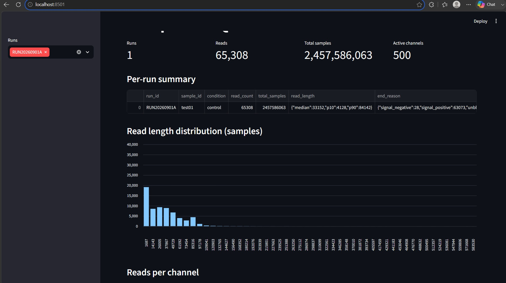

# glyphic-spine

Nextflow pipeline: nanopore POD5 signal metadata -> QC metrics -> Parquet.

## What it does
1. `POD5_VIEW`   — extracts per-read metadata from POD5 with `pod5 view`
2. `QC_SUMMARY`  — attaches sample metadata, writes per-read Parquet and run-level QC JSON

## Run
nextflow run . -profile local

## Run ID convention
`RUN<YYYYMMDD><letter>` — e.g. RUN20260901A.
Enforced at pipeline entry via `samplesheet.csv`, not by convention.

## Samplesheet
`run_id, sample_id, condition, flowcell, pod5_path`

## Notes from the first run
Test data: ONT open dataset, 65,308 reads across 500 active channels.

- **Per-channel yield is very uneven.** Average ~131 reads per channel, but the
  observed range was 1 to 173. At least one pore effectively produced nothing for
  the whole run. This is the argument for surfacing per-channel and plate-level
  comparison in a dashboard rather than leaving it to ad-hoc scripts.
- **Read length is reported in samples, not bases.** Median 33,152 samples is
  roughly 2.6–3.3 kb depending on sampling rate. `sample_rate` lives in POD5 run
  metadata and is not in the per-read table, so it needs capturing in the schema
  for anything downstream to convert without guessing.

- **Accuracy was the wrong metric.** 96.6% of reads end normally, so a model
  predicting "fine" for everything scores 96.6%. The first version scored 97.4%
  and looked good. Adding `class_weight="balanced"` dropped accuracy to 86% while
  ROC-AUC held at 0.89 — the model didn't get worse, the operating point moved.
  PR-AUC on the rare class is 0.44 against a 0.034 random baseline, ~13x lift.
  At 0.16 precision / 0.71 recall this is a screening filter, not an auto-reject
  rule; the registry logs the baselines alongside the metrics so the comparison
  is visible rather than implied.

## Status
Runs end to end on public ONT open data: samplesheet → per-read signal metadata →
Parquet and run-level QC → DuckDB → dashboard. Local executor.

Next: model versioning, so every classification traces to the model that produced it.
Then Dorado basecalling and alignment.

Not a production system — no instrument integration, alerting, or retention policy.

## Dashboard

Streamlit over DuckDB, which queries the pipeline's Parquet output in place —
no ETL, so the dashboard can't drift out of sync with what the pipeline produced.

Run: `streamlit run app.py`
